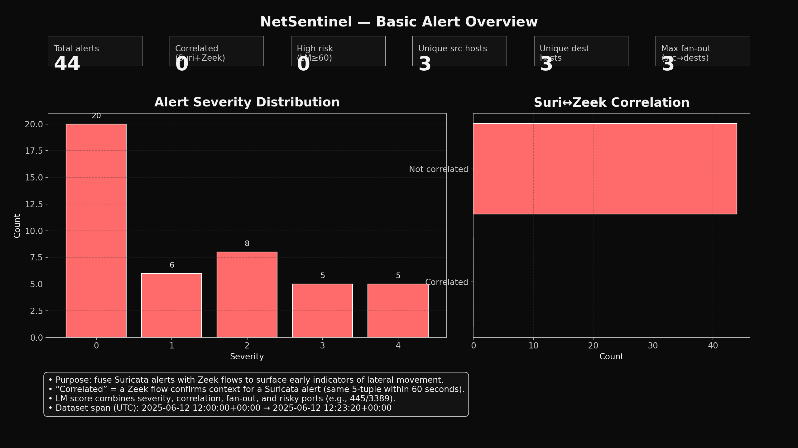
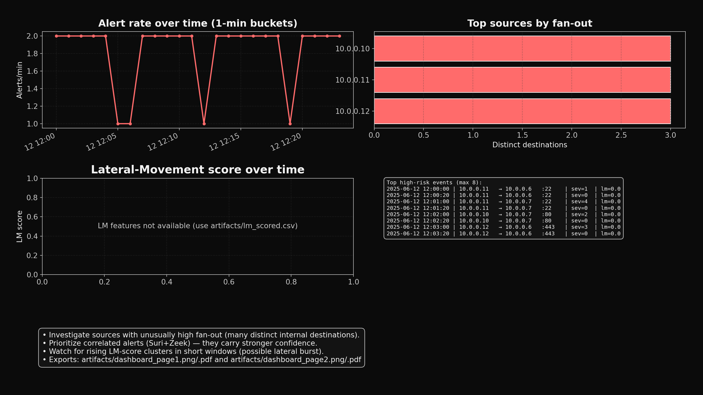

# NetSentinel --- AI-Powered Cybersecurity

## 📌 Purpose

NetSentinel is designed to fuse **network intrusion detection logs**
(Suricata + Zeek) with **machine learning--based scoring** to provide
analysts with enriched insights into **lateral movement detection** and
**threat correlation**.

This project demonstrates how raw alerts can be normalized, correlated,
scored, and visualized to highlight suspicious activities inside a
network.

It also includes a **smart contract auditing module** using **Mythril**
and **Slither** to analyze Solidity contracts for vulnerabilities.

------------------------------------------------------------------------

## 🎯 What this project serves

-   **Alert Normalization**\
    Unifies Suricata EVE JSON logs and Zeek conn.log flows into a single
    normalized schema.

-   **Correlation**\
    Matches Suricata alerts with Zeek flows on the same 5-tuple within a
    60-second window, increasing analyst confidence.

-   **Lateral Movement Detection**\
    Flags SMB (445) and RDP (3389) pivots, high fan-out connections, and
    suspicious internal movements.

-   **Machine Learning Scoring**\
    Trains a baseline ML classifier (`model.pkl`) on enriched features
    (severity, fan-out, evidence count, risky ports).

-   **Visualization Dashboard**\
    Provides an interactive two-page dark-themed dashboard showing:

    -   Severity distribution\
    -   Correlation rates\
    -   Fan-out (unique destinations per source)\
    -   Lateral Movement scoring trends\
    -   High-risk event tables

-   **Smart Contract Auditing**\
    Integrates Mythril and Slither static analysis to detect Ethereum
    smart contract vulnerabilities.

------------------------------------------------------------------------

## 📊 Example Outputs

The project generates **dashboards** that help visualize alerts and
scoring.

### Page 1 --- Basic Alert Overview



### Page 2 --- Advanced Analysis



------------------------------------------------------------------------

## 🛠️ Project Structure

    AI-Cybersecurity-Lab-2.1/
    ├── .github/workflows/ci.yml         # CI/CD with pytest
    ├── ai_alert_scoring/                # ML model + feature extractor
    ├── artifacts/                       # Generated dashboards + models
    ├── docs/                            # Architecture & ATT&CK mapping
    ├── scripts/                         # Training + audit scripts
    ├── smart_contract_audit/            # Mythril & Slither analyzers
    ├── src/netsentinel/                 # Core correlation + detection logic
    ├── suricata_alerts/                 # Suricata parser
    ├── zeek_alerts/                     # Zeek parser
    ├── tests/                           # Unit tests
    ├── Dockerfile, docker-compose.yml   # Container setup
    ├── requirements.txt                 # Python dependencies
    └── README.md                        # Project overview (this file)

------------------------------------------------------------------------

## 🚀 How to Run

1.  Install dependencies:

``` bash
pip install -r requirements.txt
```

2.  Parse alerts:

``` bash
python suricata_alerts/parse_suricata.py sample_suricata.json visualization/alert_data.csv
python zeek_alerts/parse_zeek.py sample_conn.log visualization/alert_data.csv
```

3.  Correlate logs:

``` bash
python src/netsentinel/correlator.py
```

4.  Detect lateral movement:

``` bash
python src/netsentinel/detections/lateral_movement.py
```

5.  Train ML baseline:

``` bash
python scripts/train_baseline.py
```

6.  Generate dashboard:

``` bash
python visualization/dashboard.py --save-only
```

------------------------------------------------------------------------

## 📜 License

MIT License © 2025 Faiyaz Ahmed
